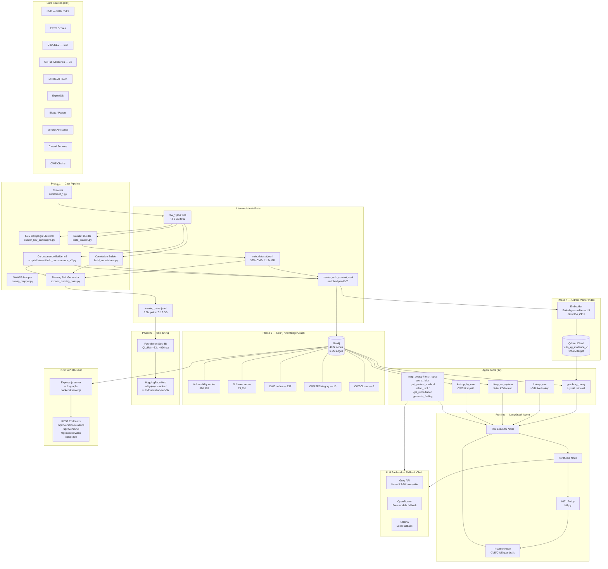
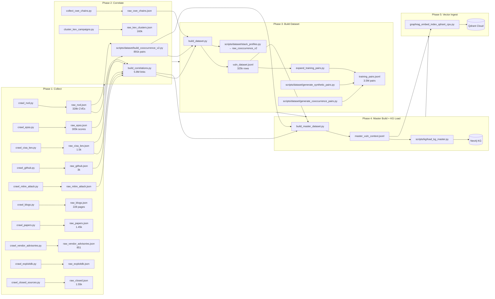
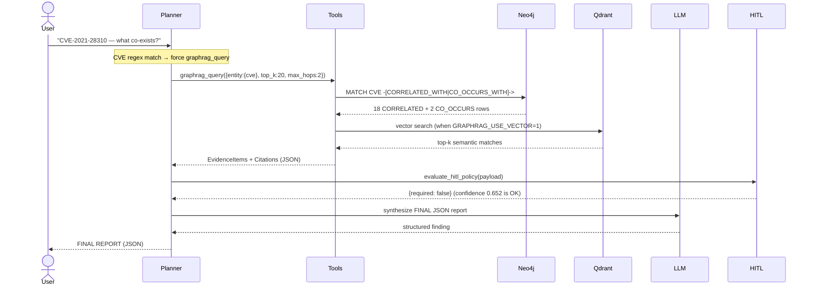
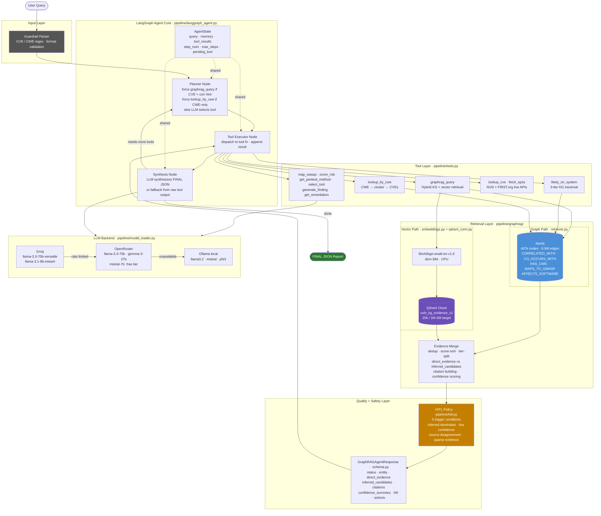
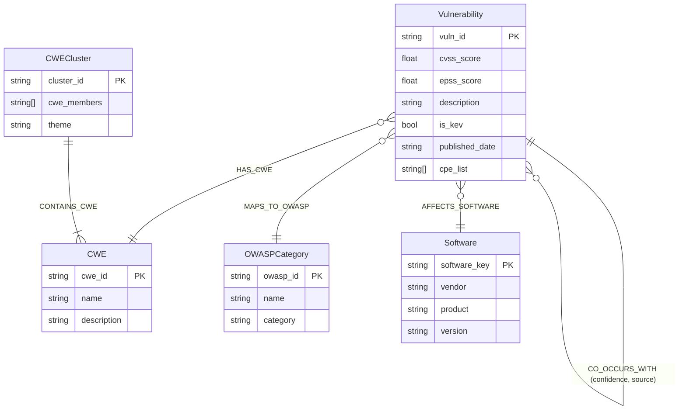
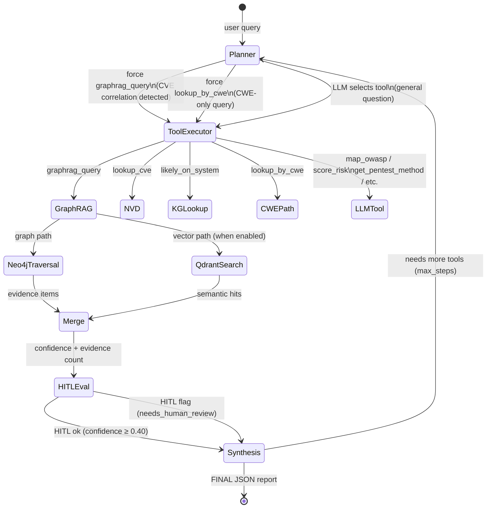

# DeplAI — Vulnerability GraphRAG Pipeline: Comprehensive Project Report

**Date:** March 9, 2026  
**Status:** Core pipeline operational — vector ingest at 20k / 1M-2M target; benchmark eval blocked by module path

---

## Table of Contents

1. [What This Project Is](#1-what-this-project-is)
2. [Why We Are Building This](#2-why-we-are-building-this)
3. [Architecture Diagram](#3-architecture-diagram)
4. [Component Deep-Dive](#4-component-deep-dive)
5. [Full Data Lineage](#5-full-data-lineage)
6. [Knowledge Graph Schema](#6-knowledge-graph-schema)
7. [Agent Reasoning Flow](#7-agent-reasoning-flow)
8. [LLM Backend & Fine-tuning](#8-llm-backend--fine-tuning)
9. [Capabilities & Features](#9-capabilities--features)
10. [Metrics & Scale](#10-metrics--scale)
11. [Known Gaps & Next Steps](#11-known-gaps--next-steps)

---

## 1. What This Project Is

DeplAI is a **domain-specialized, multi-modal cybersecurity intelligence platform**. It ingests vulnerability data from 10+ heterogeneous sources, fuses them into a Neo4j knowledge graph and a Qdrant vector index, and exposes them through a LangGraph-based agentic CLI and a REST API.

The agent can answer questions like:

- *"What co-exists with CVE-2021-28310 on a compromised system?"*
- *"Given CWE-89, what other weaknesses appear in the same attack chain?"*
- *"How likely is this CVE to be exploited, and what is the full audit finding?"*
- *"Which vulnerabilities appear together in ransomware campaigns?"*

The platform is being used to:
1. Build a **fine-tuned security LLM** (`Foundation-Sec-8B` via QLoRA) on 3.5M vulnerability training pairs.
2. Power a **hybrid GraphRAG retrieval engine** combining symbolic Neo4j graph traversal with dense Qdrant vector search.
3. Provide a structured **REST API backend** for a graph visualization frontend.

---

## 2. Why We Are Building This

### The Problem

Cybersecurity practitioners face three core intelligence challenges:

| Challenge | Industry State | What This Does |
|-----------|---------------|----------------|
| **Vulnerability relationship reasoning** | CVEs exist in silos; NVD does not model co-occurrence or attack chains | Builds explicit `CORRELATED_WITH` and `CO_OCCURS_WITH` edges from 5.8M correlation links |
| **Exploit probability prioritization** | CVSS base scores ignore real-world exploitation likelihood | Integrates EPSS scores, CISA KEV activeness, and campaign cluster membership |
| **Multi-hop attack path discovery** | General LLMs hallucinate CVE relationships | Grounds all answers in graph evidence + vector evidence + HITL policy |

### Why Foundation-Sec-8B Fine-tuning

General-purpose LLMs (GPT-4, LLaMA) do not deeply understand CVE co-occurrence patterns, CWE family relationships, or OWASP category mapping. Foundation-Sec-8B was pre-trained on 80B tokens of cybersecurity-domain text (NVD, advisories, exploit code). Fine-tuning it on our 3.5M domain-specific pairs produces an LLM that:

- Reasons about multi-CVE attack chains without hallucination
- Understands CWE hierarchy and OWASP taxonomy natively
- Can generate structured audit findings from raw evidence

### Why the Hybrid GraphRAG Approach

Pure RAG (vector-only) cannot model the **topology** of vulnerability relationships — it cannot distinguish whether two CVEs are directly correlated (same exploit), co-occurring (same product stack), or merely semantically similar text. The hybrid approach:

- Uses **Neo4j graph traversal** (structured, exact, explainable) as the primary signal
- Uses **Qdrant vector search** (semantic, recall-oriented) as a secondary signal
- Merges both into a single ranked evidence list with confidence scores and citations

---

## 3. Architecture Diagram

### High-Level System Architecture



---

### Data Flow — Detailed Pipeline



---

### Agent Execution Flow



---

### GraphRAG Agent — Architecture Diagram



---

## 4. Component Deep-Dive

### 4.1 Data Collection Layer (`data/crawl_*.py`)

All crawlers write to `data/raw_*.json`. Key crawlers:

| Crawler | Source | Output | Notes |
|---------|--------|--------|-------|
| `crawl_nvd.py` | NVD REST API v2 | `raw_nvd.json` 328k CVEs | Full CVE metadata, CVSS, CWE, CPE |
| `crawl_epss.py` | FIRST.org EPSS | `raw_epss.json` 305k | Daily exploit probability scores |
| `crawl_cisa_kev.py` | CISA KEV catalog | `raw_cisa_kev.json` 1.5k | Known-exploited vulnerabilities |
| `crawl_github.py` | GitHub Security Advisories | `raw_github.json` 3k | Patch info, GHSA IDs |
| `crawl_mitre_attack.py` | MITRE ATT&CK STIX | `raw_mitre_attack.json` | Technique-to-CVE mappings |
| `crawl_blogs.py` | Agentic Tavily + crawl4ai | `raw_blogs.json` 228 | LLM-driven URL discovery + quality filter |
| `crawl_papers.py` | Academic papers | `raw_papers.json` 1.45k | Research on exploit patterns |
| `crawl_vendor_advisories.py` | MSRC, Cisco, etc. | `raw_vendor_advisories.json` 851 | Vendor-specific mitigations |
| `crawl_closed_sources.py` | HackerOne, Reddit | `raw_closed.json` 1.55k | Bug bounty + community signals |
| `crawl_exploitdb.py` | Exploit-DB | `raw_exploitdb.json` | PoC exploit code (currently 0 — broken) |

**Blog crawler is fully agentic:**  
Uses Groq LLM to generate search queries → Tavily finds URLs → crawl4ai downloads pages → quality keyword filter keeps only security-relevant content → LLM gap-analysis generates Round 2 queries.

---

### 4.2 Correlation & Co-occurrence Layer

**`build_correlations.py`** — builds `raw_correlations.json`:
- Joins NVD + EPSS + GitHub + KEV + MITRE ATT&CK
- Emits up to 20 related CVEs per source CVE (capped to control hub noise)
- Minimum correlation score threshold: ≥0.60
- Output: 328k rows, 5.8M total links

**`scripts/dataset/build_cooccurrence_v2.py`** — builds `raw_cooccurrence_v2.json`:
- 8 co-occurrence signal types:

| Signal Type | Count | Meaning |
|-------------|------:|---------|
| `product_cooccurrence` | 574,457 | Same product/version affected |
| `high_conf_same_stack` | 133,910 | Same tech stack fingerprint |
| `vendor_kev` | 85,493 | Same vendor in CISA KEV |
| `temporal_kev` | 54,749 | Same KEV disclosure window |
| `cwe_can_precede` | 23,255 | CWE chain — one weakness enables another |
| `ransomware_kev` | 19,494 | Same ransomware campaign |
| `attack_chain` | 458 | Direct exploit chain evidence |
| `conditional_same_stack` | 118 | Same stack with conditional dependency |

**`cluster_kev_campaigns.py`** — groups KEV entries by temporal proximity and vendor overlap into 160k campaign cluster entries with 63 negative inference rules (pairs that look similar but are NOT related).

**`scripts/dataset/stack_profiles.py`** — builds 22,192 stack profiles (technology fingerprints) used as co-occurrence signals.

**`collect_cwe_chains.py`** — maps CWE parent-child and can-precede relationships, feeding `HAS_CWE` and `CONTAINS_CWE` graph edges.

---

### 4.3 Dataset Builder

**`data/build_dataset.py`** → `vuln_dataset.jsonl` (325k rows, 1.34 GB):

Each row is a rich per-CVE JSON containing:
- CVE ID, description, CVSS score, EPSS probability
- CWE IDs, OWASP category  
- Affected software list (CPEs)
- Correlated CVEs (up to 20) with confidence scores
- Co-occurring CVEs with signal types
- ATT&CK technique references
- Source references (NVD, GitHub, KEV, vendor)

**`data/expand_training_pairs.py`** + synthetic generators → `training_pairs.jsonl` (3.5M pairs, 3.17 GB):

Training pair distribution across 8 task layers:

| Layer | Count | % | Purpose |
|-------|------:|---|---------|
| `vulnerability_cooccurrence` | 1,568,794 | 44.7% | "CVE-X and CVE-Y co-occur because..." |
| `vulnerability_correlation` | 602,732 | 17.2% | "CVE-X is related to CVE-Y due to..." |
| `execution_context` | 325,964 | 9.3% | Stack-aware tooling |
| `vulnerability_intelligence` | 306,152 | 8.7% | OWASP / CWE mapping |
| `audit_evidence` | 306,051 | 8.7% | Audit finding generation |
| `remediation_learning` | 254,161 | 7.2% | Fix recommendations |
| `risk_scoring` | 140,784 | 4.0% | CVSS/EPSS risk assessment |
| `pentesting_intelligence` | 4,813 | 0.1% | Attack payloads, detection |

---

### 4.4 Neo4j Knowledge Graph

**Node types:**

| Label | Count | Primary ID | Description |
|-------|------:|-----------|-------------|
| `Vulnerability` | 326,969 | `vuln_id` (CVE-XXXX-XXXXX) | Core CVE nodes with all metadata |
| `Software` | 79,991 | `software_key` | CPE-based product/version nodes |
| `CWE` | 737 | `cwe_id` | Weakness type nodes |
| `OWASPCategory` | 10 | `owasp_id` | OWASP Top 10 categories |
| `CWECluster` | 6 | `cluster_id` | Grouped CWE families |

**Relationship types:**

| Relationship | Count | Direction | Properties |
|-------------|------:|-----------|-----------|
| `CORRELATED_WITH` | 5,120,356 | CVE ↔ CVE | `max_score`, `reasons`, `signals` |
| `CO_OCCURS_WITH` | 891,953 | CVE ↔ CVE | `max_confidence`, `source`, `signals` |
| `AFFECTS_SOFTWARE` | 499,086 | CVE → Software | CPE version range |
| `HAS_CWE` | 254,048 | CVE → CWE | Primary/secondary |
| `MAPS_TO_OWASP` | 162,704 | CVE → OWASPCategory | Category match |
| `CONTAINS_CWE` | 39 | CWECluster → CWE | Cluster membership |

**Total:** 407,713 nodes, 6,928,186 relationships

**Uniqueness constraints** enforced on all node IDs to prevent duplicates.  
**Self-loop guards** prevent any CVE from being correlated to itself.

---

### 4.5 Qdrant Vector Index

- **Collection:** `vuln_kg_evidence_v1`
- **Embedding model:** `BAAI/bge-small-en-v1.5`, dim=384, cosine similarity, CPU inference
- **Target size:** 1,000,000 – 2,000,000 vectors (planned; sourced from `master_vuln_context.jsonl`)
- **Ingest pipeline:** `graphrag_embed_index_qdrant_cpu.py` — streaming, no full JSON load in memory
- **Throughput observed:** 15.60 embeddings/sec on smoke test (2,000 vectors in 128s)
- **Chunk strategy:** 900-char structural chunks with 120-char overlap, boundary-aware splitting (prefers section breaks over mid-sentence cuts)
- **Sources chunked:** `vuln_dataset.jsonl` + `raw_correlations.json` + `raw_cooccurrence_v2.json` + optional KG edge chunks
- **Two-phase alternative:** `graphrag_embed_local.py` (cache to JSONL) → `graphrag_upsert_cache.py` (batch upsert)

---

### 4.6 LangGraph Agent (`pipeline/langgraph_agent.py`)

The agent uses a **3-node state machine:**

```
START → [Planner] → [Tool Executor] → [Synthesis/HITL] → (loop or END)
```

**Planner guardrails** (deterministic before LLM planning):
- If query contains `CVE-\d{4}-\d+` AND any correlation hint phrase → force `graphrag_query` as step 1
- If query contains `CWE-\d+` → force `lookup_by_cwe` as step 1
- Otherwise → LLM chooses tool sequence

**12 tools registered:**

| Tool | Tier | Backend |
|------|------|---------|
| `graphrag_query` | Primary | Neo4j + Qdrant hybrid |
| `lookup_cve` | Enrichment | NVD live API |
| `likely_on_system` | KG | Neo4j 3-tier traversal |
| `lookup_by_cwe` | KG | Neo4j CWE cluster |
| `map_owasp` | LLM | Groq/OR/Ollama |
| `get_pentest_method` | LLM | Groq/OR/Ollama |
| `select_tool` | LLM | Groq/OR/Ollama |
| `fetch_epss` | API | FIRST.org EPSS |
| `score_risk` | LLM | Groq/OR/Ollama |
| `generate_finding` | LLM | Groq/OR/Ollama |
| `get_remediation` | LLM | Groq/OR/Ollama |
| *(fallback)* | KG | `likely_on_system` fallback |

---

### 4.7 HITL Policy (`pipeline/hitl.py`)

Deterministic risk-triggered Human-in-the-Loop escalation. Triggers when any of:

1. Inferred evidence dominates direct evidence AND direct < 2 results
2. Overall confidence score < 0.40
3. Source disagreement: graph and vector/raw-cooccurrence both present, but no direct corroboration
4. CVE context with < 2 direct results AND top likelihood < 0.50
5. High confidence (>0.60) with sparse total evidence (<3 items) — over-estimation guard

When triggered, response includes `"hitl": {"required": true, "reasons": [...]}` and status `"needs_human_review"`.

---

### 4.8 GraphRAG Schema (`pipeline/graphrag/schema.py`)

Every agent response conforms to a strict Pydantic contract:

```python
GraphRAGAgentResponse:
  status: "ok" | "needs_human_review" | "error"
  query: str
  entity: {type: "cve"|"cwe"|"unknown", id: str}
  direct_evidence: [EvidenceItem]   # from KG direct edges
  inferred_candidates: [EvidenceItem]  # from 2-hop or vector
  citations: [Citation]             # source-traceable references
  confidence_summary: {overall: float, rationale: str}
  hitl: {required: bool, reasons: [str]}
  recommended_actions: [str]
```

`EvidenceItem` carries: `cve_id`, `likelihood [0,1]`, `evidence_tier`, `rel_type`, `signals`, `reasons`, `inferred_from`.

---

### 4.9 LLM Backend (`pipeline/model_loader.py`)

Three-tier fallback chain:

```
Groq (fastest, free 14.4k req/day)
  └─► llama-3.3-70b-versatile (best quality)
  └─► llama-3.1-8b-instant (rate limit fallback)
  └─► llama3-8b-8192 (solid general fallback)
  └─► llama-3.2-11b-text-preview

  ↓ (if Groq fails/rate-limited)

OpenRouter (free models)
  └─► meta-llama/llama-3.3-70b-instruct:free
  └─► google/gemma-3-27b-it:free
  └─► mistralai/mistral-7b-instruct:free

  ↓ (if OpenRouter unavailable)

Ollama (local, zero rate limits)
  └─► llama3.2 / mistral / llama3.1 / phi3
```

8 domain-specific system prompts per task **layer** — the model_loader routes each tool call to the correct security persona (`vulnerability_intelligence`, `audit_evidence`, `vulnerability_correlation`, etc.).

---

### 4.10 REST API Backend (`vuln-graph-backend/server.js`)

Express.js server exposing Neo4j through REST with:
- Rate limiting (default 120 req/min per IP, configurable)
- Optional API key authentication (`X-API-Key` header)
- CORS allowlist (configurable, defaults to localhost only)
- Strict CVE/CWE format validation before any Cypher execution (injection prevention)

**Endpoints:**

| Method | Endpoint | Returns |
|--------|----------|---------|
| GET | `/api/health` | DB connectivity status |
| GET | `/api/graph?limit=300` | Full graph subgraph for visualization |
| GET | `/api/cve/:cveId` | CVE node properties |
| GET | `/api/cve/:cveId/correlations` | CORRELATED_WITH + CO_OCCURS_WITH neighbors |
| GET | `/api/cve/:cveId/full` | CVE + all edges (CWE, OWASP, SW, clusters) |
| GET | `/api/cve/:cveId/chain` | Exploit chain CVEs |
| GET | `/api/cwe/:cweId/vulns` | CVEs in a CWE family + sibling CWEs |
| GET | `/api/search?q=...` | Text search across vuln_id / description |

---

### 4.11 Fine-tuning (`training/finetuning.py` + `finetuning_phase2.py`)

**Base model:** `fdtn-ai/Foundation-Sec-8B` (Llama 3.1-8B, pre-trained on 80B cybersecurity tokens)

**QLoRA config:**
- Rank `r=32`, `lora_alpha=64`, `lora_dropout=0.1`
- 4-bit quantization (BitsAndBytes NF4)
- `max_length=4096` (captures multi-CVE correlation sequences)
- Paged AdamW 8-bit optimizer
- Memory budget: ~15.5 GB → fits A100 40GB

**Training data composition (weighted sampler):**
- `vulnerability_correlation` layer: **3× oversample** — densest relational signal
- `vulnerability_cooccurrence` layer: **3× oversample** — primary attack chain evidence
- All other layers: 1× (standard)

**Phase 2 continuation** (`finetuning_phase2.py`): resumes from Phase 1 checkpoint with updated data mix and learning rate scheduling.

**Target repo:** `adityajayashankar/vuln-foundation-sec-8b` on HuggingFace Hub.

---

### 4.12 Evaluation (`eval/`)

**`run_graphrag_benchmark.py`** — Held-out CVE set benchmark:
- Computes **P@K, R@K** (K ∈ {5, 10, 20}) and false-positive rate
- Uses `data/heldout_cve_benchmark.jsonl` (held-out from training)
- Auto-generates benchmark JSONL from raw artifacts if missing
- Outputs results to `eval/results/graphrag_eval.csv` and `.json`

**`eval/ground_truth_benchmark.jsonl`** — manually verified CVE pairs with annotated positive/negative ground truth labels.

**`eval/probe_cooccurrence.py`** — lightweight smoke probe for co-occurrence edge quality.

---

### 4.13 Validation

**`scripts/analysis/validate_dataset.py`** — dataset quality checker:
- Token length distribution (with/without tokenizer)
- Duplicate detection and optional deduplication (`--fix`)
- Short-output detection (drops examples <80 chars)
- Layer coverage analysis

**`scripts/analysis/validate_dataset.py`** — deep vuln_dataset checks:
- CVSS/EPSS/CWE/software coverage percentages
- Expected count thresholds per layer

**KG validation** (Cypher queries defined in `docs/kg/KG_VALIDATION_CHECKLIST.md`):
- Schema + volume sanity (labels, relationship types, constraint existence)
- Null/duplicate node IDs
- Self-loop detection
- Coverage checks (fraction of CVEs with CWE, OWASP, software edges)
- Source alignment spot-checks (sample CVE → compare KG edges to raw JSON)

---

## 5. Full Data Lineage

```
NVD API ──────────────────────────────────────────────┐
EPSS API ───────────────────┐                         │
CISA KEV ──────────────┐    │                         │
GitHub Advisories ─┐   │    │                         │
MITRE ATT&CK ──┐   │   │    │                         │
Blogs/Papers ─┐│   │   │    │                         │
Vendors ─────┘│   │   │    └──► build_correlations ──► raw_correlations.json (830MB)
              ├───┴───┘         build_cooccurrence_v2 ► raw_cooccurrence_v2.json (184MB)
              │                 cluster_kev_campaigns ► raw_kev_clusters.json (41MB)
              │                 collect_cwe_chains ───► raw_cwe_chains.json (5MB)
              │                 stack_profiles ────────► (embedded in cooccurrence)
              │
              └──► build_dataset.py ──────────────────► vuln_dataset.jsonl (325k, 1.34GB)
                        │
                        ├──► expand_training_pairs ──► training_pairs.jsonl (3.5M, 3.17GB)
                        │    generate_cooccurrence_pairs
                        │    generate_synthetic_pairs
                        │
                        └──► build_master_dataset ───► master_vuln_context.jsonl
                                    │
                                    ├──► load_kg_master ──────────────► Neo4j (407k nodes, 6.9M edges)
                                    └──► graphrag_embed_index_cpu ────► Qdrant (20k / 1M-2M target)
```

---

## 6. Knowledge Graph Schema



---

## 7. Agent Reasoning Flow



---

## 8. LLM Backend & Fine-tuning

### Why Foundation-Sec-8B instead of a general LLM?

| Dimension | General LLM (LLaMA 3.1-8B) | Foundation-Sec-8B |
|-----------|--------------------------|------------------|
| Pre-training data | General internet | + 80B cybersecurity tokens |
| CVE description parsing | Moderate | Strong (domain vocabulary) |
| CWE/OWASP reasoning | Inconsistent | Consistent |
| Exploit chain inference | Hallucinates often | Grounded with our fine-tune |
| Context window | 8192 | 8192 (train at 4096) |

### QLoRA Design Rationale

- **r=32 (up from 16):** Higher rank needed to capture dense relational graph between CVE ↔ CWE ↔ ATT&CK ↔ OWASP. r=16 under-parameterizes cross-entity associations.
- **4096 token context:** ~22% of correlation pairs were silently truncated at 2048 tokens (verified with Llama 3 tokenizer which tokenizes security text at ~2.7 chars/token).
- **3× oversampling of correlation/cooccurrence layers:** These layers represent only ~71.5% of the dataset but are the highest-value signal for multi-CVE attack path reasoning.

---

## 9. Capabilities & Features

### What the system can do today:

| Capability | Status | Mechanism |
|-----------|--------|-----------|
| CVE correlation lookup | ✅ Full | Neo4j CORRELATED_WITH traversal |
| CVE co-occurrence lookup | ✅ Full | Neo4j CO_OCCURS_WITH traversal |
| CWE-first vulnerability family query | ✅ Full | `lookup_by_cwe` → CWECluster path |
| EPSS exploit probability | ✅ Full | FIRST.org live API |
| OWASP Top 10 category mapping | ✅ Full | LLM with domain prompt |
| Attack method / payload lookup | ✅ Full | LLM `pentesting_intelligence` layer |
| Security tool recommendation | ✅ Full | LLM `execution_context` layer |
| Risk scoring + CVSS analysis | ✅ Full | LLM `risk_scoring` layer |
| Audit finding generation | ✅ Full | LLM `audit_evidence` layer |
| Remediation recommendation | ✅ Full | LLM `remediation_learning` layer |
| Hybrid vector + graph retrieval | ⚠️ Partial | Vector ingest in progress (20k / 1M-2M target) |
| Full semantic evidence retrieval | 🔲 Pending | Requires full Qdrant ingest completion |
| Fine-tuned model inference | 🔲 Pending | Training pending full data pipeline |
| REST API for graph frontend | ✅ Full | Express.js + Neo4j driver |

### Agentic Blog Crawler

A fully agentic web intelligence crawler that:
1. Uses Groq LLM to generate 12 high-yield security search queries (no hardcoded URLs)
2. Searches via Tavily AI-optimized search API
3. Downloads pages via crawl4ai (async, 15 concurrent workers)
4. Applies a quality keyword filter (cve, exploit, payload, injection, rce, xss, sqli, etc.)
5. Runs LLM gap analysis to identify missing coverage → generates Round 2 queries
6. Caps at 370 total URLs to control cost

### HITL Policy

The deterministic HITL escalation ensures the agent **never silently returns low-confidence answers** without flagging them. Every response carries machine-readable HITL status, enabling downstream systems to route uncertain findings to human reviewers automatically.

### Dataset Completeness

| Quality Metric | Value |
|---------------|-------|
| CVEs with CVSS | 93.90% |
| CVEs with EPSS | 93.33% |
| CVEs with CWE | 77.92% |
| CVEs with affected software | 86.91% |

---

## 10. Metrics & Scale

### Raw Data Scale

| Artifact | Records | Size |
|----------|--------:|-----:|
| `raw_nvd.json` | 328,000 | 283.5 MB |
| `raw_correlations.json` | 328,000 | 830.4 MB |
| `raw_cooccurrence_v2.json` | 891,953 | 184.4 MB |
| `raw_kev_clusters.json` | 160,594 | 41.2 MB |
| `raw_epss.json` | 305,266 | 8.6 MB |
| `raw_github.json` | 3,000 | 10.0 MB |
| `vuln_dataset.jsonl` | 325,941 | 1,340.1 MB |
| `master_vuln_context.jsonl` | 325,942 | 3,055.0 MB |
| **Total** | | **~5.8 GB** |

### Knowledge Graph Scale

- **407,713 nodes**, **6,928,186 relationships**
- **5,120,356** CORRELATED_WITH edges (primary reasoning edges)
- Planned **1M-2M chunks** for vector indexing (from `master_vuln_context.jsonl`)

### Agent Performance (live probe — CVE-2021-28310)

> **Note:** Automated benchmark (`eval/run_graphrag_benchmark.py`) currently returns errors (`No module named 'pipeline'`) when run outside the project root. The figures below are from a manual agent probe.

- Primary tool call: `graphrag_query` (forced by CVE + correlation guardrail)
- Direct evidence returned: **20 results** (18 CORRELATED_WITH + 2 CO_OCCURS_WITH)
- Overall confidence: **0.652**
- HITL escalation: **not required**

---

## 11. Known Gaps & Next Steps

| Gap | Impact | Fix |
|----|--------|-----|
| Vector ingest incomplete (20k / 1M-2M target) | Hybrid retrieval underutilized | Run full ingest: `--max-vectors 1000000` (or `2000000`) |
| Benchmark eval errors (`No module named 'pipeline'`) | P@K / R@K scores unmeasurable; all 120 probes fail | Run from project root with `PYTHONPATH=.` or via `python -m eval.run_graphrag_benchmark` |
| `raw_exploitdb.json` is empty | No PoC exploit evidence layer | Fix ExploitDB crawler auth/pagination |
| Blog dataset small (228 pages) | Limited web threat intelligence | Re-run agentic crawler with wider queries |
| Decommissioned LLM model IDs in old configs | Rate limit exhaustion if triggered | Confirmed clean in current `model_loader.py` |
| Fine-tuned model not yet deployed | Agent uses API LLMs, not domain model | Complete training run + push to HF Hub |

---

## Quick Reference: Run Order

```powershell
# 1. Activate venv
.\.venv\Scripts\Activate.ps1

# 2. Collect + build full pipeline
python run_pipeline.py

# 3. Validate dataset
python scripts/analysis/validate_dataset.py --no-tokenizer

# 4. Build master dataset
python data/build_master_dataset.py

# 5. Load Neo4j KG
python scripts/kg/load_kg_master.py

# 6. Start vector ingest (1M chunk target)
python scripts/maintenance/graphrag_embed_index_qdrant_cpu.py --max-vectors 1000000 --batch-size 64 --qdrant-batch-size 256

# 7. Run agent
python main.py

# 8. Run benchmark evaluation
python eval/run_graphrag_benchmark.py

# 9. Start REST API backend
cd vuln-graph-backend && node server.js
```

---

*Report generated March 9, 2026 — DeplAI Vulnerability GraphRAG Pipeline*
